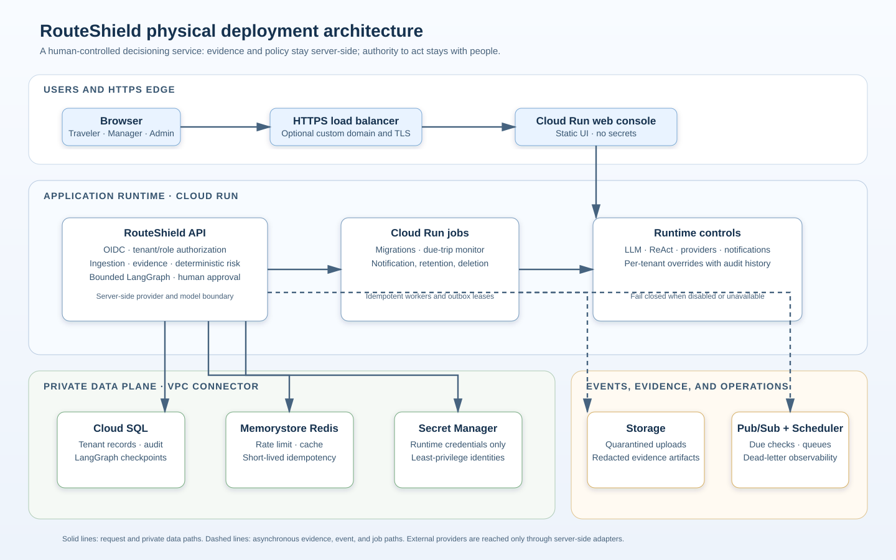

# Product Requirements Document

## Corporate Travel Route-Risk & Disruption Agent

| Field | Value |
|---|---|
| Product name | RouteShield |
| Author | Sarala Biswal |
| Version | 1.1 |
| Status | Build-ready MVP specification |
| Primary deployment | Google Cloud Platform |
| Agent framework | LangChain + LangGraph |
| LLM integration | OpenAI Responses API, called server-side through LangChain |
| Default operational model | gpt-5.6-terra, configurable by environment |
| Primary users | Corporate travel managers, travelers, duty-of-care teams |

## 1. Executive summary

RouteShield is a corporate travel operations agent that detects likely trip disruption, investigates the evidence using a bounded ReAct loop, and prepares an evidence-backed recovery recommendation for a human travel manager.

The MVP uses deterministic eligibility and an explainable weighted recovery score. A separately deployed, post-MVP **Learned Recovery Ranker** may later learn how to order eligible recovery options from observed, consented-for operational outcomes. It is a governed ranking service, not an LLM capability and not an authority to bypass travel policy or human approval.

The product is not an autonomous booking bot. Deterministic services own risk scoring, policy checks, authorization, notifications, and all external side effects. The LLM is an active component: it interprets verified evidence, chooses among narrowly scoped read-only investigation tools, explains the disruption, and drafts a structured recommendation. A LangGraph workflow makes the agent stateful, resumable, observable, and interruptible for human approval.

The MVP is deployed on GCP using Cloud Run, Cloud SQL for PostgreSQL, Memorystore for Redis, Pub/Sub, Cloud Scheduler, Cloud Storage, Secret Manager, and least-privilege service identities. The OpenAI API key is stored only in Secret Manager and is never exposed to a browser, repository, log, or client application.

## 2. Problem statement

Corporate travel teams currently monitor disruptions manually across airline, weather, mapping, booking, and security portals. They often learn of a missed connection or delayed airport transfer too late to preserve an important meeting or find a cost-effective recovery option.

The system must answer:

> Which upcoming trips are materially at risk, what verified evidence explains the risk, and what action should a travel manager take before the disruption becomes costly?

## 3. Product vision

RouteShield becomes the operational intelligence layer between a corporate itinerary and a travel manager's action:

    itinerary event
        -> verified live signals
        -> deterministic risk assessment
        -> bounded ReAct investigation
        -> policy-eligible recovery options
        -> optional learned ranking of those options
        -> human-approved intervention
        -> auditable outcome

The value proposition is early, explainable action:

    protected value =
      avoidable missed-connection and rebooking cost
      + travel-manager time saved
      + protected traveler productivity
      + reduced risk to business-critical meetings

## 4. Goals and non-goals

### 4.1 Goals

1. Detect disruption risk before the traveler is stranded or misses a business-critical event.
2. Combine live flight, weather, aviation weather, ground-route, and destination-advisory evidence.
3. Demonstrate a genuine, bounded ReAct workflow that chooses investigation tools based on evidence.
4. Produce concise, source-linked recommendations for travel managers and travelers.
5. Require human approval before rebooking, cancellation, financial action, or policy exception.
6. Persist graph state, approvals, evidence, and outcomes for auditability and debugging.
7. Deploy a real cloud application on GCP with a real OpenAI API integration.
8. Be demonstrable from a public GitHub repository without relying solely on synthetic model output.
9. Capture the decision and outcome data needed to safely evaluate a future learned recovery-ranking service.

### 4.2 Non-goals for MVP

1. Autonomous ticketing, refunds, cancellations, payment, or policy overrides.
2. Replacing a travel management company or airline operations system.
3. Determining whether a destination is objectively safe for a traveler.
4. Medical, legal, immigration, or security advice.
5. Global production coverage across every airline and country on day one.
6. Direct access by the LLM to SQL, arbitrary web browsing, provider credentials, or unrestricted HTTP.
7. Training or deploying the Learned Recovery Ranker in the MVP before sufficient, governed outcome data exists.

## 5. Launch scope

### 5.1 MVP boundary

The first release supports U.S.-origin corporate air itineraries with:

- One to three flight segments.
- Ground journey to the departure airport.
- A destination country/region advisory display.
- Traveler and trip criticality metadata.
- CSV/manual itinerary ingestion and a simulated booking-system webhook.
- Travel-manager review and traveler notification workflows.

### 5.2 Monitoring windows

The product creates or refreshes an assessment:

- when a trip is created or modified;
- 72 hours before departure;
- 24 hours before departure;
- 6 hours before departure;
- 2 hours before departure;
- when a supported source reports a material change;
- when a travel manager requests refresh;
- when a traveler asks a trip-related question.

### 5.3 Learned Recovery Ranker rollout boundary

The Learned Recovery Ranker is a Phase 2 capability. It may be enabled for a tenant only after the platform has a documented, representative history of eligible alternatives and final outcomes, approved data-use terms, and the promotion gates in Section 16.6 have passed.

Until then, RouteShield shall use the deterministic, policy-configured recovery score and clearly label its basis. The initial production launch must not fabricate training labels, train from LLM prose, or present a learned model as more certain than the evidence supports.

## 6. Users and jobs to be done

| Persona | Job to be done | Success outcome |
|---|---|---|
| Traveler | Know what to do when a trip may fail | Receives timely, concise, verified guidance |
| Travel manager | Prioritize trips needing intervention | Reviews only material incidents with evidence and a proposed action |
| Duty-of-care lead | See elevated destination or transit risk | Receives escalation for policy-defined critical events |
| Travel operations lead | Measure operational effectiveness | Sees alert quality, resolution time, and value protected |
| Platform administrator | Operate securely | Controls tenant access, sources, policies, model configuration, and audit retention |

## 7. Success metrics

### 7.1 Product metrics

| Metric | MVP target |
|---|---|
| Material-risk alert precision | At least 75% after tuning against the evaluation set |
| Material-risk alert recall | At least 85% for curated disruption scenarios |
| Time from event to manager-ready recommendation | Under 90 seconds for cached/available sources |
| LLM output validation success | At least 99% after one allowed repair attempt |
| Unauthorized external side effects | 0 |
| Every material claim has source evidence | 100% |
| Duplicate incidents for the same assessment window | 0 |

### 7.2 Business metrics

- High/Critical incidents resolved before scheduled departure.
- Median travel-manager handling time per disruption.
- Estimated cost avoided per resolved incident.
- Traveler notification acknowledgement rate.
- Percentage of recommendations accepted by travel managers.

### 7.3 Phase 2 learning metrics

Before a learned model is enabled, RouteShield shall establish deterministic-baseline values for the following metrics per approved tenant segment. A learned model must improve or preserve the approved business measures while meeting the safety gates in Section 16.6.

| Metric | Why it matters |
|---|---|
| Feasible recovery option at rank 1 | A manager should see a usable option first |
| Recovery accepted or selected | Measures practical recommendation value, not only offline relevance |
| Arrival before business-critical deadline | Connects ranking to protected business value |
| Policy-compliant and accessibility-compliant recovery | Ensures optimization does not trade away hard obligations |
| Incremental approved cost and manager handling time | Captures economic and operational value |

### 7.4 Memory capability metrics

| Metric | Target |
|---|---|
| High/Critical approval threads resumed with the same incident state | 100% in checkpoint/resume tests |
| Long-term preference retrieval on a new thread | 100% for tenant/traveler-scoped test fixtures |
| Memory writes with a durable actor, source, before/after diff, and consent status | 100% |
| Unconfirmed LLM-proposed profile changes committed automatically | 0 |
| Restricted data written to long-term memory or an LLM prompt | 0 |

## 8. Functional requirements

### FR-01: Tenant and role access

The system shall support the roles below:

| Role | Permissions |
|---|---|
| Traveler | View only their own trips, incidents, and approved guidance |
| Travel manager | View assigned tenant trips; approve/reject eligible recommendations |
| Duty-of-care lead | View critical escalations and destination-risk context |
| Tenant administrator | Manage users, policy configuration, source configuration, and retention |
| Platform administrator | Operate infrastructure; no default tenant-data access |

Every data object, graph thread, memory namespace, and query shall include a tenant identifier.

### FR-02: Itinerary ingestion

The system shall:

1. Accept CSV upload, manual entry, and webhook-style JSON.
2. Validate IATA codes, segment order, UTC timestamps, and required traveler context.
3. Store the original upload in Cloud Storage with restricted access.
4. Normalize the itinerary into relational records.
5. Create a monitoring schedule and initial baseline assessment.
6. Reject invalid data with actionable feedback rather than passing it to the LLM.

Minimum data model:

    tenant_id
    traveler_id
    trip_id
    trip_criticality
    traveler_constraints
    segment_id
    carrier_code
    flight_number
    departure_airport
    arrival_airport
    scheduled_departure_at
    scheduled_arrival_at
    ground_origin
    destination_country

For every recovery assessment that yields alternatives, the system shall also persist an immutable candidate-set record containing:

    incident_id
    candidate_set_id
    candidate_id
    eligibility_result and exclusion_reasons
    normalized_candidate_features
    deterministic_recovery_score and score_version
    displayed_position
    ranker_score, ranker_model_version, and feature_schema_version when enabled
    manager/traveler selection or override
    final itinerary and material outcome fields

The candidate-set record is the source of truth for later ranking evaluation. It must distinguish options that were unavailable, policy-ineligible, offered, viewed, selected, rejected, and completed; a missing outcome must never be silently treated as a negative label.

### FR-03: Evidence collection

The system shall collect and normalize:

| Evidence category | Required tool behavior |
|---|---|
| Flight status | Fetch actual/estimated times, cancellation, terminal/gate, and delay state |
| Connection feasibility | Calculate connection buffer and airport-transfer feasibility |
| Public weather | Retrieve weather alerts relevant to departure, connection, and arrival |
| Aviation weather | Retrieve airport observations/forecasts and applicable aviation hazards |
| Ground route | Retrieve traffic-aware travel duration to the departure airport |
| Destination context | Retrieve advisory level and risk indicators with source/time |
| Alternative flights | Retrieve only read-only alternatives from an approved travel provider |
| Corporate policy | Retrieve the applicable travel policy as structured rules |

Each evidence item shall contain:

    evidence_id
    source_name
    source_record_id
    retrieved_at
    valid_until
    raw_payload_reference
    normalized_payload
    reliability_status

### FR-04: Deterministic risk engine

Risk calculation shall run in normal Python code, not in the LLM.

Initial weighted score:

| Dimension | Range | Weight |
|---|---:|---:|
| Flight disruption | 0-100 | 35% |
| Connection fragility | 0-100 | 20% |
| Airport and aviation weather | 0-100 | 20% |
| Ground-route disruption | 0-100 | 10% |
| Destination advisory context | 0-100 | 10% |
| Traveler/trip criticality | 0-100 | 5% |

Severity bands:

    0-24   Low       Monitor only
    25-49  Watch     Optional traveler notification or manager queue
    50-74  High      ReAct investigation and manager-ready recommendation
    75-100 Critical  ReAct investigation, urgent manager review, duty-of-care policy evaluation

The engine shall persist:

    policy_version
    risk_score
    severity
    factor_contributions
    assessment_time
    evidence_ids

### FR-05: ReAct disruption investigation

ReAct is the principal agentic capability. It is activated only for:

- High or Critical assessments;
- Watch assessments explicitly opened by a manager;
- a traveler/manager question requiring investigation;
- conflicting, stale, or incomplete evidence needing bounded follow-up.

The agent must follow this loop:

    1. Observe the trip, risk score, evidence, policy, and prior actions.
    2. Decide whether another approved read-only tool is required.
    3. Call one allowed tool using structured arguments.
    4. Observe validated, normalized tool output.
    5. Repeat up to the configured iteration limit.
    6. Produce a structured recommendation or return needs_human_review.

The maximum number of LLM tool-selection iterations is three per assessment. The maximum number of LLM completion calls is two per assessment: investigation and final recommendation. Exceptions require an explicit product configuration and audit record.

### FR-06: ReAct tool allow-list

The LLM may request only the following tools:

    get_trip_context(trip_id)
    get_flight_status(segment_id)
    get_connection_feasibility(trip_id)
    get_airport_weather(airport_code, time_window)
    get_ground_route_risk(trip_id)
    get_destination_advisory(country_code)
    find_alternative_flights(trip_id)
    get_corporate_travel_policy(tenant_id, trip_id)
    propose_memory_update(memory_type, patch, source_message_id)

Tools must be:

- server-side only;
- individually authenticated to their provider;
- validated with Pydantic request and response models;
- tenant-scoped;
- timeout and retry bounded;
- logged with a correlation ID;
- read-only in the ReAct loop.

`propose_memory_update` creates only a Pydantic-validated draft in graph state. It has no Store, database, or profile-write permission; the confirmation workflow defined in FR-14 performs any later commit.

The graph, not the model, owns any write tool. The only permitted post-approval writes are:

    create_manager_review
    notify_traveler
    record_approval
    create_booking_action_request

### FR-07: Recommendation output

The LLM shall return validated structured output with this logical schema:

    recommendation_id
    incident_id
    severity_explanation
    evidence_ids
    uncertainty
    recommended_action
    ranked_alternative_ids
    traveler_message
    manager_message
    requires_human_approval
    missing_information

Rules:

1. Every material claim must cite one or more evidence IDs.
2. The model must not modify the deterministic severity or score.
3. It may present only alternatives supplied by an approved tool, preserving the deterministic or Learned Recovery Ranker order returned by that tool.
4. It must return high uncertainty if required evidence is missing or stale.
5. It must not produce a booking or policy decision.

### FR-08: Human approval and interruption

The graph shall interrupt for:

- rebooking or reservation change;
- cancellation, refund, credit, or payment-impacting request;
- policy exception;
- Critical duty-of-care escalation;
- recommendation whose uncertainty is high;
- manually requested manager review.

The approval payload shall include:

    original itinerary
    current risk assessment
    evidence and source timestamps
    policy result
    proposed recommendation
    traveler-facing message preview
    proposed external action payload

The approving manager may approve, reject, or edit the recommendation. The result must be persisted with actor, timestamp, reason, and final action payload.

### FR-09: Dashboard and notifications

The application shall provide:

- Manager queue sorted by severity, departure time, and trip criticality.
- Trip timeline with assessments, evidence, graph milestones, and approvals.
- Incident detail with an understandable answer to “why is this at risk?”
- Source freshness and provider failure indicators.
- Approval/rejection screen.
- Traveler notification preview and delivery status.
- Filterable metrics dashboard.

### FR-10: Audit and replay

The system shall retain:

- normalized input;
- deterministic assessment;
- tool calls and tool responses, with sensitive fields redacted;
- model input summary, model ID/snapshot, prompt version, token/cost metadata;
- memory-context version and retrieval result, plus every memory proposal, patch, confirmation, rejection, or deletion;
- validated model output;
- graph checkpoints;
- approval decision;
- dispatched action and outcome.

Authorized administrators can inspect the graph timeline and replay a scenario in a non-production environment. Production replay must never accidentally send notifications or booking actions.

### FR-11: Runtime controls and kill switches

The tenant administrator and platform administrator shall have auditable, independently deployable controls for:

    LLM_ENABLED
    REACT_TOOL_CALLS_ENABLED
    NOTIFICATIONS_ENABLED
    APPROVAL_ACTIONS_ENABLED
    MEMORY_READS_ENABLED
    MEMORY_WRITES_ENABLED
    PROVIDER_{NAME}_ENABLED
    TENANT_AUTOMATION_ENABLED

Required behavior:

1. Disabling LLM_ENABLED stops new model calls immediately; deterministic evidence collection and manager-visible assessments may continue.
2. Disabling REACT_TOOL_CALLS_ENABLED allows the application to produce only deterministic, source-linked status summaries.
3. Disabling NOTIFICATIONS_ENABLED prevents dispatch but continues to create an auditable pending notification.
4. Disabling APPROVAL_ACTIONS_ENABLED prevents approved external actions from dispatching while retaining the approval decision.
5. A provider-specific switch removes the provider from graph routing and produces an explicit unavailable signal.
6. Every switch change records the actor, scope, reason, prior value, new value, and expiration/review time.
7. Disabling MEMORY_READS_ENABLED prevents long-term profile retrieval for new graph steps and records a manager-visible personalization-unavailable state; it does not erase existing audit records.
8. Disabling MEMORY_WRITES_ENABLED rejects new proposal confirmations and explicit profile updates while preserving pending proposals for review or deletion.

### FR-12: Time, accessibility, and notification experience

The application shall:

1. Store all event timestamps in UTC and display scheduled departure/arrival in the relevant airport local time and UTC.
2. Use IANA timezone identifiers; never infer time zones from airport text alone.
3. Display the source timestamp and freshness state beside every material disruption signal.
4. Use accessible severity labels that do not rely only on color.
5. Support keyboard navigation, screen-reader labels, clear focus states, and accessible error/interrupt states.
6. Support English-language MVP templates with a localization-ready message model.
7. Let a traveler choose approved notification channels and acknowledgement preferences subject to tenant policy.
8. Never expose a manager-only recommendation or policy rationale in a traveler notification.

### FR-13: Learned Recovery Ranker (Phase 2)

The Learned Recovery Ranker shall order only alternatives that have already passed deterministic availability, itinerary-feasibility, corporate-policy, accessibility, and approval-threshold checks. It shall never create an alternative, relax a hard constraint, make a booking decision, or change the deterministic disruption severity.

The ranker shall accept a tenant-scoped incident context and the complete set of eligible alternatives, and return:

    candidate_id
    ranking_score
    rank_position
    model_version
    training_data_hash
    feature_schema_version
    ranking_generated_at
    fallback_used

The default objective is to maximize the expected quality of a recovery outcome while respecting hard constraints. The initial offline label specification shall combine, under a versioned business policy:

- traveler/manager acceptance or selection;
- successful arrival before the business-critical deadline;
- policy compliance and accessibility accommodation;
- lower avoidable delay and disruption duration;
- lower approved incremental cost; and
- reduced manual handling or avoidable repeat disruption.

The following boundary is mandatory:

    deterministic candidate generation and hard policy filter
        -> deterministic or learned ordering of all eligible candidates
        -> ReAct explanation using returned order and evidence
        -> human approval for any side effect

The LangGraph assistant receives the ranking result as validated tool data. It may explain the ordering and request human review, but may not alter, suppress, or invent ranked alternatives. If the ranker is unavailable, stale, disabled, or outside its approved data domain, the system shall use the deterministic recovery score, disclose the fallback to the manager, and continue the approval workflow.

The service shall be trained and served independently of the OpenAI integration. A practical implementation may adapt the `learning-to-rank-distillation` lifecycle: a higher-capacity offline LambdaMART teacher, a distilled two-tower student with precomputed candidate embeddings, versioned model bundles, benchmarked serving, and a promotion gate. The copied business logic must be travel-specific; marketplace supplier-exposure optimization is not a default travel objective.

### FR-14: Governed LangGraph memory and cross-thread personalization

RouteShield shall implement the following four memory capabilities: short-term incident continuity, consented long-term traveler preferences, auditable memory patches, and cross-thread personalization. Memory is contextual assistance; it is never an authority over deterministic policy, current provider evidence, or approval controls.

#### Short-term incident continuity

Each assessment runs in the thread:

    tenant:{tenant_id}:trip:{trip_id}:incident:{incident_id}

The production PostgreSQL checkpointer shall persist the JSON-serializable state required to resume an interrupted or failed investigation, including the assessment snapshot, evidence references and freshness, tool audit, eligible alternatives, ranking result, recommendation, approval payload, dispatched-action idempotency keys, and bounded conversation messages. On resume, the graph must use the checkpoint rather than re-run an already approved action or silently fetch a new state.

#### Long-term traveler memory

Long-term memory is a small, versioned `TravelerPreferenceProfile` plus an optional collection of scoped `TravelPreferenceRule` records. The allowed profile fields are:

    preferred_airports
    preferred_carriers
    cabin_or_seat_preference
    minimum_connection_minutes
    avoid_overnight_connections
    approved_ground_transport_preferences
    notification_channel and language
    approved_accessibility_accommodations
    consent_version
    updated_at

The graph may load a minimal, validated profile snapshot before a new assessment. The snapshot is advisory input to eligibility and ranking; applicable corporate policy, real-time availability, and current traveler constraints remain authoritative.

Long-term data shall use namespaces with exact tenant and traveler scope:

    ("traveler_profile", tenant_id, traveler_id)
    ("travel_preference_rule", tenant_id, traveler_id)
    ("manager_feedback", tenant_id)

Cross-namespace search, global traveler search, and use of one tenant's memory in another tenant's graph are prohibited.

#### Auditable memory updates

An explicit traveler settings change may be written directly by the authenticated API after schema validation. The LLM may identify a possible preference only by returning a `MemoryUpdateProposal`; it cannot write to the Store. A proposal must include:

    proposal_id
    memory_type
    target namespace and record ID
    before value
    proposed patch / after value
    source message or explicit UI action reference
    confidence
    consent_required
    status
    actor and timestamps

An authenticated traveler or authorized travel manager must confirm an inferred profile preference before it is committed. The UI shall display the exact patch. Every committed change records the actor, source, prior/new version, and consent state. The implementation shall provide a Trustcall-style patch/audit trace, but no automatic “save whenever the agent decides” behavior.

#### Feedback and procedural guidance

Manager overrides and final recovery outcomes shall be stored as structured `ManagerFeedback` records for evaluation and future ranking-data curation. They must not be inserted into a traveler profile or prompt as unverified facts.

Tenant communication and escalation playbooks may be retrieved as versioned, administrator-approved procedural guidance. They are read-only to the agent; the agent must never rewrite its own system prompt, policy, or procedural instructions from a conversation.

#### Explicit exclusions

The system shall not store raw conversation transcripts, live flight/weather/fare facts, corporate policy, passport/visa data, payment data, medical data, location history, or unapproved inferred sensitive attributes as long-term memory. It shall not use memory to bypass an itinerary constraint, rank an ineligible option, or autonomously execute an action.

## 9. LLM and LangChain requirements

### 9.1 Required runtime libraries

The backend shall use:

    langchain
    langchain-openai
    langgraph
    langgraph-checkpoint-postgres
    pydantic
    fastapi
    sqlalchemy
    asyncpg

The exact versions shall be compatibility-pinned in a lock file and upgraded through the evaluation pipeline.

### 9.2 LangChain responsibilities

LangChain shall provide:

- the OpenAI chat-model client;
- structured tool declarations;
- Pydantic structured output binding;
- prompt templates;
- standardized message objects;
- provider abstraction for future model-provider substitution.

The application shall instantiate the LLM through a single provider adapter, conceptually:

    LLMProvider
      -> ChatOpenAI
      -> bound read-only tools
      -> structured Recommendation schema

No route handler, UI component, or graph node may construct an ad hoc model client.

### 9.3 LangGraph responsibilities

LangGraph shall provide:

- typed graph state;
- explicit node/edge control flow;
- ReAct assistant-to-tools loop;
- parallel baseline evidence nodes;
- conditional routing by severity and policy;
- durable checkpoints;
- thread-level execution;
- approval interrupts;
- streaming graph events to the UI;
- time-travel debugging in non-production environments.

The graph must use a production PostgreSQL checkpointer. In-memory checkpointers are permitted only in unit tests, notebooks, and local prototypes.

### 9.4 OpenAI model policy

Environment defaults:

| Use case | Model | Reason |
|---|---|---|
| ReAct investigation and recommendation | gpt-5.6-terra | Balances reasoning quality and cost |
| High-volume extraction or concise notification rewrite | gpt-5.6-luna | Cost-sensitive, bounded workload |
| Offline evaluation of difficult scenarios | gpt-5.6-sol | Stronger complex reasoning; not normal live-path default |

The model choice is configuration, not application code:

    OPENAI_MODEL_PRIMARY=gpt-5.6-terra
    OPENAI_MODEL_FAST=gpt-5.6-luna
    OPENAI_MODEL_EVAL=gpt-5.6-sol

Before production use, a dated model snapshot shall be selected through evaluation and stored in deployment configuration. A model change requires regression tests against the golden scenario set.

### 9.5 OpenAI API key requirements

The system uses a real OpenAI API key in deployed environments. Requirements:

1. Create a dedicated project/service key for RouteShield; do not use a developer's personal key.
2. Store the value only in GCP Secret Manager as a secret named OPENAI_API_KEY.
3. Grant Secret Manager Secret Accessor only to the dedicated Cloud Run API service account.
4. Inject the secret into the API service at runtime as the OPENAI_API_KEY environment variable.
5. Never place keys in the repository, Docker image, Terraform state, browser code, logs, traces, notebooks, or .env.example.
6. Rotate the key on schedule and immediately after suspected exposure.
7. Use separate keys and secrets for development, staging, and production.
8. Enforce provider-side usage limits and an application-side tenant budget.

Local development uses a developer-created .env file ignored by Git:

    OPENAI_API_KEY=local_development_key_only
    OPENAI_MODEL_PRIMARY=gpt-5.6-terra

The frontend must never call OpenAI directly. All model calls originate from the authenticated FastAPI service.

### 9.6 Prompt and output controls

The system prompt shall require the model to:

    - use only supplied evidence and tool results;
    - cite evidence IDs for material claims;
    - never invent flight status, weather, routes, policy, fares, or approvals;
    - never override risk score or severity;
    - return high uncertainty when evidence is inadequate;
    - never issue a booking, payment, cancellation, or refund instruction;
    - respect the structured output schema.

Pydantic validates every model output. On failure:

    first failure  -> one repair attempt with validation errors
    second failure -> create needs_human_review recommendation
    no fallback    -> never convert malformed prose into an action

### 9.7 Ranking-service boundary

The Learned Recovery Ranker is a conventional ML service and is not invoked through the OpenAI API. The API service shall call it through an internal, authenticated `RecoveryRankingAdapter` after policy eligibility is complete. Its request and response models shall be Pydantic-validated, tenant-scoped, latency-bounded, and logged with the incident correlation ID.

The LLM receives only the returned candidate identities, ordering, score bands/reason codes approved for display, and model/fallback status. Raw training data, feature vectors, model weights, and the ranker's internal embeddings must not enter the prompt.

## 10. LangGraph workflow

### 10.1 Graph topology

    START
      -> normalize_itinerary
      -> collect_baseline_evidence
          -> flight_status        ┐
          -> connection_risk      │ parallel
          -> weather_risk         │
          -> ground_route_risk    │
          -> destination_context  ┘
      -> validate_evidence
      -> calculate_risk
      -> route_by_severity

    Low
      -> persist_assessment
      -> END

    Watch
      -> optionally notify
      -> persist_assessment
      -> END

    High or Critical
      -> load_memory_context
      -> react_assistant
      -> react_tools
      -> verify_alternative_eligibility (when alternatives are returned)
      -> rank_eligible_recovery_options (when eligible alternatives exist)
      -> react_assistant
      -> validate_recommendation
      -> policy_gate
      -> approval_interrupt
      -> dispatch_approved_action
      -> persist_audit
      -> END

### 10.2 Graph state

    RouteRiskState:
      trip
      traveler_context
      memory_context
      memory_context_version
      memory_update_proposal
      monitoring_event
      evidence
      source_failures
      risk_assessment
      react_iterations
      tool_audit
      eligible_alternatives
      recovery_ranking
      recommendation
      policy_decision
      approval
      dispatched_actions
      audit_events
      messages

State must be JSON-serializable. It must not contain an API client, database session, secret, function object, or raw unbounded provider payload.

### 10.3 ReAct routing behavior

The assistant node may route to:

    tools             when it issues an allowed read-only tool call
    validate_output   when it returns a valid structured recommendation
    needs_review      when evidence is missing, stale, conflicting, or tool limit reached

The tool router must reject:

- a tool name not in the allow-list;
- invalid arguments;
- cross-tenant resource identifiers;
- more than three ReAct iterations;
- calls after an approval state begins;
- write tools from the assistant.

When `find_alternative_flights` returns candidates, the graph-owned `verify_alternative_eligibility` node must evaluate every returned candidate before the assistant produces a final recommendation. `rank_eligible_recovery_options` then orders the complete eligible set using the configured deterministic score or, for an approved Phase 2 tenant, the Learned Recovery Ranker. This node is not an LLM tool-selection decision and must preserve its input/output audit record.

## 11. GCP deployment architecture

### 11.1 Architecture

### 11.1.1 Physical deployment view

    Browser
      -> Cloud Load Balancer / HTTPS
      -> Next.js web application on Cloud Run
      -> FastAPI API + LangGraph service on Cloud Run
      -> Learned Recovery Ranker on Cloud Run (Phase 2; internal ingress)
      -> Cloud SQL for PostgreSQL
      -> Memorystore for Redis
      -> Pub/Sub
      -> Cloud Run Jobs
      -> Cloud Storage
      -> Secret Manager

    Cloud Run API and jobs
      -> OpenAI Responses API
      -> internal Learned Recovery Ranker (Phase 2)
      -> flight status provider
      -> weather and aviation weather providers
      -> Google Routes API
      -> destination advisory source

### 11.2 GCP service responsibilities

| GCP service | Purpose |
|---|---|
| Cloud Run API service | FastAPI API, LangGraph execution, authenticated user requests, SSE/WebSocket-compatible streaming strategy |
| Cloud Run ranker service (Phase 2) | Internal-only low-latency student-model serving; reads an approved, immutable recovery-ranker bundle and exposes authenticated ranking/health/metrics endpoints |
| Cloud Run web service | Next.js dashboard and traveler experience |
| Cloud Run Jobs | Scheduled assessment refreshes, backfills, provider reconciliation |
| Cloud SQL for PostgreSQL | Tenant data, trips, assessments, approval records, audit events, LangGraph checkpoints and store |
| Memorystore for Redis | Cache provider data, distributed locks, short-lived rate limiting, idempotency state |
| Pub/Sub | Decouple ingest, refresh, and notification events |
| Cloud Scheduler | Publish assessment-due events at configured time windows |
| Cloud Storage | Original uploads, test fixtures, redacted evidence artifacts, immutable versioned recovery-ranker bundles, and evaluation reports |
| Secret Manager | OpenAI and third-party provider secrets |
| Artifact Registry | Container image storage |
| Cloud Logging and Monitoring | Metrics, logs, alerts, dashboards |
| Cloud Trace / OpenTelemetry | End-to-end request, tool, and graph correlation |

### 11.3 Service identities and permissions

Use separate user-managed service accounts:

    routeshield-api-sa
    routeshield-web-sa
    routeshield-monitor-sa
    routeshield-ranker-sa
    routeshield-deployer-sa

Apply least privilege:

| Identity | Required access |
|---|---|
| API service | Cloud SQL client, Secret Manager accessor for API/provider secrets, Pub/Sub publisher, Cloud Storage object access scoped to tenant upload bucket |
| Monitor job | Cloud SQL client, Secret Manager accessor, Pub/Sub publisher, provider outbound network access |
| Ranker service (Phase 2) | Read-only access to the approved model-bundle prefix, Cloud Logging/Monitoring writer, and authenticated invocation only from the API service identity |
| Web service | No OpenAI key; only API invocation or browser-safe configuration |
| Deployer | Artifact Registry writer and narrowly scoped Cloud Run deployment permissions |

Never set GOOGLE_APPLICATION_CREDENTIALS inside Cloud Run. Use the Cloud Run service identity and Application Default Credentials for GCP service access.

### 11.4 Network and ingress

1. Public web access must use HTTPS.
2. The API is authenticated through OIDC/JWT-based application authentication.
3. Browser-to-API calls include tenant-aware authorization claims.
4. Cloud SQL must not be publicly exposed.
5. Outbound calls to OpenAI and providers originate from server-side workloads only.
6. Production egress should use a controlled network path and a documented allow-list where the organization requires it.
7. Provider egress failures must be represented as source failures, not transformed into a low-risk conclusion.
8. The Phase 2 ranker service must use internal ingress and accept authenticated requests only from the RouteShield API service identity; it must not be browser-addressable.

### 11.5 GCP-aligned security statement

This design is GCP-hosted and aligned with GCP IAM, Secret Manager, Cloud Run service identity, private database access, logging, and encryption controls. It is not by itself a statement of HIPAA, PCI, SOC 2, GDPR, or data-residency certification. Because the LLM is called through an external API, legal, privacy, procurement, retention, and data-transfer requirements must be approved before production customer data is processed.

## 12. Persistence and data design

### 12.1 PostgreSQL tables

    tenants
    users
    travelers
    traveler_preference_profiles
    travel_preference_rules
    memory_update_proposals
    memory_audit_events
    manager_feedback
    trips
    flight_segments
    monitoring_events
    evidence_items
    risk_assessments
    incidents
    recommendations
    recovery_candidate_sets
    recovery_candidates
    recovery_ranking_decisions
    recovery_ranker_models
    approvals
    notifications
    provider_failures
    tool_audit_events
    model_invocations
    action_requests
    action_outcomes

LangGraph checkpointer and cross-thread store tables shall be maintained separately and access-controlled.

### 12.2 LangGraph persistence

- Use AsyncPostgresSaver or the compatible production PostgreSQL checkpointer.
- Use thread IDs structured as:

    tenant:{tenant_id}:trip:{trip_id}:incident:{incident_id}

- The checkpointer is the short-term, incident-thread continuity mechanism. Its state is a resumable operational record, not a reusable traveler profile.
- Store long-term preferences separately under a namespaced tenant/traveler key and retrieve only an allow-listed, current profile snapshot for the graph.
- A long-term store may be database-backed or implemented with the access-controlled preference tables above; it must provide equivalent namespace, versioning, and deletion semantics.
- Store only business-appropriate traveler preferences, such as preferred airport or approved accessibility accommodation flag, with source and consent metadata.
- Do not place payment, passport, visa, medical, location-history, raw conversation, or unnecessary personal data into prompts or long-term memory.
- Memory proposals, confirmations, patches, retrievals, and deletions must be correlated to tenant, traveler, graph thread when applicable, actor, and policy/consent version.

## 13. Provider integration requirements

| Provider/domain | MVP integration | Failure behavior |
|---|---|---|
| OpenAI | Responses API through langchain-openai | Return needs_human_review; no action without validated output |
| Flight status | Amadeus or pluggable provider adapter | Mark flight signal unknown/stale and escalate uncertainty |
| Public weather | NWS alert adapter | Record source failure and use most recent valid evidence only within freshness policy |
| Aviation weather | AviationWeather.gov adapter | Record unknown; do not infer safe conditions |
| Ground routing | Google Routes adapter | Use cached duration only if within freshness threshold |
| Destination advisory | State Department adapter | Display source context; never create autonomous travel ban |
| Notifications | Email/SMS/Teams/Slack adapter selected per tenant | Retry through queue; show delivery status |

All adapters must implement a provider-neutral interface so they can be mocked in tests or replaced commercially.

### 13.1 Data Source & Provider Adapter Matrix

This matrix is an application requirement. The values under Freshness are RouteShield application policies, not promises made by a public-data provider. A source response may be current, cached, delayed, empty, or unavailable; the adapter must expose that condition to the graph.

| Adapter / LangGraph tool | API and signal used | Access and required secret | RouteShield freshness policy | Fallback and fail-safe behavior | Production replacement option |
|---|---|---|---|---|---|
| FlightStatusAdapter / get_flight_status | Amadeus On-Demand Flight Status: schedule, terminal/gate, estimated/actual times, delay state | Developer API; AMADEUS_CLIENT_ID and AMADEUS_CLIENT_SECRET in Secret Manager | Cache 5 minutes inside T-6; 15 minutes before T-6; stale after 15 and 45 minutes respectively | Mark individual flight state unknown or stale. Retain last valid result only with timestamp. Add uncertainty; never infer a flight is on time. | Contracted flight-status provider or TMC/GDS feed such as FlightAware AeroAPI, Cirium, or the enterprise booking feed |
| FaaNasAdapter / get_airport_nas_status | FAA NAS Status: U.S. ground stops, ground-delay programs, departure/arrival delays, closures, and forecast events | Public FAA source; no key. Current machine-readable feeds include the public airport-events/airport-status-information endpoints; endpoint format must be feature-flagged because the feed is not a contracted API SLA. | Poll/cache every 5 minutes normally; 1 minute only for Critical incident refresh; stale after 10 minutes | Use last valid event only when under 10 minutes old; otherwise mark airport-wide delay signal unknown. Do not convert an empty or failed feed into no-delay. | Contracted global airport-delay product or airline/TMC operational feed |
| NwsAlertsAdapter / get_public_weather_alerts | NWS active watches, warnings, advisories, and forecasts for U.S. airport/ground-route coordinates | Open U.S. government API; no key. Configure a descriptive User-Agent with support contact. | Cache 5 minutes near departure; 15 minutes otherwise; stale after 30 minutes | Use most recent valid alert only within stale threshold; supplement with aviation-weather signal. If both fail, weather contribution is unknown and score uncertainty rises. | Commercial weather-risk provider if global operational coverage/SLA is required |
| AviationWeatherAdapter / get_aviation_weather | AviationWeather.gov METAR, TAF, SIGMET, AIRMET, PIREP and airport observations/forecasts | Public API; no key | Cache METAR 10 minutes, TAF 30 minutes, and hazard products 15 minutes; stale after 30, 90, and 45 minutes respectively | For U.S. airport weather, fall back to NWS public alerts. For non-U.S. routes, mark aviation weather unknown and do not claim safe conditions. | Commercial aviation weather provider with global SLA |
| GroundRouteAdapter / get_ground_route_risk | Google Routes API traffic-aware drive duration, alternate routes, and route matrix | Google Maps Platform key and billing account; GOOGLE_MAPS_API_KEY in Secret Manager. Restrict key to server-side API and approved services. | Cache 5 minutes inside T-6; 15 minutes otherwise; stale after 10 and 30 minutes respectively | Use cached route only within threshold; otherwise remove the ground-route factor from the score and explain that live commute data is unavailable. Never manufacture a traffic duration. | HERE, TomTom, or a contracted mobility provider |
| DestinationAdvisoryAdapter / get_destination_advisory | U.S. State Department Travel Advisory level and risk indicators | Public source; no key for MVP adapter. If an API/feed is unavailable, implement a documented, terms-reviewed ingestion process. | Refresh every 24 hours; refresh every 6 hours for trips to Level 3/4 destinations; stale after 48 hours | Show last valid advisory as dated context only. Do not create a travel ban, safety conclusion, or autonomous escalation solely from stale data. | Enterprise travel-risk and duty-of-care provider |
| HistoricalPerformanceAdapter / get_historical_performance | BTS On-Time Performance: U.S. carrier delays, cancellations, diversions, airport/carrier history | Public data; no key | Monthly/periodic ingestion for evaluation and route-risk calibration only; never queried on the live critical path | No live fallback is needed. If unavailable, retain last versioned dataset and surface its data period. | Licensed operational analytics dataset if required |
| OpenSkyEnrichmentAdapter / get_aircraft_position | Optional OpenSky aircraft-position enrichment for demonstration only | Developer account/OAuth may be required; OPEN_SKY_CLIENT_ID and OPEN_SKY_CLIENT_SECRET only if enabled | Cache 1 to 5 minutes; stale after 10 minutes | No risk decision may depend solely on this adapter. Do not call it on every trip, and do not use its absence as a negative flight-status signal. | Remove in production or replace with contracted flight tracking |

### 13.2 Required public-data source usage

The MVP shall use real data from the following sources:

| Need | Required MVP source | Use in the graph |
|---|---|---|
| Individual flight status | Amadeus Flight Status | ReAct tool result and flight-disruption factor |
| U.S. airport system delay | FAA NAS Status | Airport disruption factor and explanation evidence |
| U.S. weather alerts | National Weather Service | Weather-risk factor and explanation evidence |
| Aviation weather | AviationWeather.gov | Airport weather/hazard factor and explanation evidence |
| Airport commute traffic | Google Routes API | Ground-route factor and departure-time recommendation |
| Historical evaluation | BTS On-Time Performance | Golden-scenario generation and score calibration |
| Destination context | State Department Travel Advisories | Informational duty-of-care context; not an autonomous decision |

The public FAA feed must be treated as airport/system-level evidence. It cannot replace a per-flight flight-status provider. The BTS dataset must be treated as historical evidence. It cannot replace live flight, airport, or weather data.

### 13.3 Adapter contract and implementation rules

Every provider adapter shall implement the same conceptual contract:

    fetch(request, tenant_context, correlation_id) -> EvidenceEnvelope

EvidenceEnvelope shall contain:

    source_name
    source_type
    source_url_or_record_id
    retrieved_at
    observed_at
    expires_at
    freshness_status = fresh | cached | stale | unavailable
    normalized_payload
    raw_payload_reference
    provider_latency_ms
    provider_request_id
    error_code

Implementation requirements:

1. The adapter, not the LLM, owns HTTP calls and credentials.
2. Each adapter validates request and response payloads with Pydantic models.
3. Each adapter has a provider-specific timeout, bounded retry policy, and circuit breaker.
4. Each adapter caches by normalized request, source, and tenant-safe scope.
5. Adapter errors are returned as structured evidence failures; they are not raised as unhandled graph exceptions.
6. Every result contains a freshness status. A model cannot cite stale evidence as current.
7. Public-source URLs and parser versions are configuration values behind feature flags.
8. Tests use captured/redacted fixtures. Tests never require a live provider key.
9. An adapter can be replaced without modifying the LangGraph state schema, risk engine, or prompt contract.

### 13.4 Source health routing

The graph shall use the following rule before risk calculation:

    all required evidence fresh
      -> calculate risk normally

    one non-critical signal stale/unavailable
      -> calculate risk with explicit unknown factor and uncertainty increase

    flight status unavailable for High/Critical candidate
      -> create needs_human_review; do not send an automated all-clear

    two or more core sources unavailable
      -> persist source-health incident, notify travel manager of limited visibility, stop ReAct tool loop

Core sources are flight status, FAA/NAS airport status for U.S. itineraries, weather, and ground route when the departure time is within six hours.

### 13.5 Secret and configuration matrix

| Configuration | Required in local development | Required in GCP staging/production | Owner |
|---|---:|---:|---|
| OPENAI_API_KEY | Yes | Yes, Secret Manager only | Platform administrator |
| AMADEUS_CLIENT_ID | Yes for live-flight demo | Yes | Provider integration owner |
| AMADEUS_CLIENT_SECRET | Yes for live-flight demo | Yes, Secret Manager only | Provider integration owner |
| GOOGLE_MAPS_API_KEY | Yes for traffic-aware route demo | Yes, Secret Manager only | Platform administrator |
| OPEN_SKY_CLIENT_ID / OPEN_SKY_CLIENT_SECRET | Optional | No by default | Demo owner |
| FAA_NAS_STATUS_URL | Yes, non-secret configuration | Yes, non-secret configuration and feature flag | Platform administrator |
| NWS_USER_AGENT | Yes | Yes | Platform administrator |
| PROVIDER_*_ENABLED flags | Yes | Yes | Tenant/platform administrator |

No key may be stored in a CSV upload, database business table, client bundle, notebook output, committed .env file, test fixture, or tracing payload.

## 14. API requirements

### 14.1 External application API

    POST /v1/trips
    GET  /v1/trips/{trip_id}
    POST /v1/trips/{trip_id}/assess
    GET  /v1/incidents
    GET  /v1/incidents/{incident_id}
    POST /v1/incidents/{incident_id}/approve
    POST /v1/incidents/{incident_id}/reject
    POST /v1/incidents/{incident_id}/refresh
    GET  /v1/runs/{run_id}/events

### 14.2 Event contracts

    trip.created
    trip.updated
    assessment.due
    provider.flight_changed
    assessment.completed
    incident.created
    approval.requested
    approval.completed
    memory_update.proposed
    memory_update.confirmed
    memory_update.rejected
    memory_update.deleted
    notification.requested
    notification.delivered

Every event must have:

    event_id
    tenant_id
    trip_id
    correlation_id
    emitted_at
    idempotency_key

### 14.3 API security and integration controls

1. All browser and partner API requests require an authenticated OIDC/JWT identity.
2. Authorization shall be enforced at tenant, role, trip, and incident level on every request.
3. Mutating endpoints require an idempotency key and return a stable action/request identifier.
4. List endpoints require pagination, tenant-safe filtering, and an upper bound on page size.
5. Webhooks require HTTPS, a signed payload, timestamp validation, replay protection, schema validation, and a provider-specific secret.
6. CSV uploads require content-type validation, file-size limits, malware scanning, parser limits, and formula-injection-safe export handling.
7. API rate limits shall apply per tenant, actor, route, and source IP where appropriate.
8. API error responses must not expose stack traces, secrets, cross-tenant identifiers, or raw provider payloads.

## 15. Non-functional requirements

### 15.1 Reliability

- Idempotent assessment processing.
- Provider timeouts and bounded retries.
- Circuit breaker per external provider.
- No duplicate notification/action from graph replay or job retry.
- Persistent checkpointer for all approval-capable flows.
- Transactional outbox or equivalent pattern for action dispatch.

### 15.2 Performance

| Path | Target |
|---|---|
| Baseline assessment with healthy sources | Under 30 seconds |
| High-risk manager-ready recommendation | Under 90 seconds |
| Dashboard incident list | Under 2 seconds at MVP scale |
| Approval resume to dispatch | Under 15 seconds excluding provider latency |

### 15.3 Cost controls

- Do not call an LLM for Low risk.
- Bound ReAct to three tool iterations and two completion calls.
- Cache provider results by trip, source, and freshness window.
- Cap output tokens for recommendations.
- Enforce a per-tenant daily model budget.
- Record token use, provider calls, and estimated cost per assessment.

### 15.4 Privacy and retention

- Encrypt data in transit and at rest.
- Redact sensitive data from logs, traces, prompts, and evaluation fixtures.
- Separate tenant data logically and enforce it at query level.
- Define retention periods for original uploads, checkpoints, evidence, long-term memory, and audit events.
- Support deletion workflows required by the organization's privacy policy.

### 15.5 Data classification and retention schedule

| Classification | Examples | Default retention | Control |
|---|---|---:|---|
| Public operational data | Public NWS alert, FAA airport-delay event, published travel advisory | 90 days cached evidence | Preserve source/time and respect source terms |
| Confidential business data | Tenant policy, trip criticality, manager recommendation, alternative ranking | 365 days after trip completion | Tenant-scoped access and audit logging |
| Restricted personal travel data | Traveler name, corporate email, itinerary, exact ground origin, accessibility preference | 90 days after trip completion | Minimize prompt inclusion; encrypted storage; role-based access |
| Consented long-term preference data | Preferred airport/carrier, connection tolerance, notification preference, approved accessibility accommodation | Until withdrawn or 12 months after last active trip | Explicit consent/version, profile scope, self-service review/delete, no raw-chat storage |
| Graph execution data | Checkpoints, model input summaries, redacted tool traces | 90 days | Restricted administrator access; replay only in non-production |
| Security audit data | Approval decision, access event, control-plane change, dispatch outcome | 365 days minimum | Append-only audit access policy |
| Original upload | CSV and import artifact | 30 days after successful normalization | Delete automatically unless legal hold or tenant configuration requires otherwise |

Rules:

1. Tenant configuration may extend retention only with documented business/legal justification.
2. A deletion request must remove or anonymize restricted personal data, derived memory, cached provider data, and access links within 30 days unless legal hold applies.
3. Legal holds suspend deletion only for explicitly scoped records and must be auditable.
4. Backups follow a documented expiry schedule; deleted data may persist only until the next backup-expiry cycle.
5. The LLM receives the minimum restricted data necessary for the task; traveler email, passport, payment, and unnecessary profile fields are excluded by default.

### 15.6 Service-level objectives and disaster recovery

| Service objective | MVP target | Measurement |
|---|---:|---|
| Manager dashboard/API availability | 99.5% monthly | Successful authenticated requests / valid requests |
| Scheduled assessment completion | 99% within 15 minutes of due time | Due event to completed/explicitly failed assessment |
| Critical incident manager notification | 99% within 5 minutes after valid critical assessment | Assessment completion to queued manager notification |
| Assessment data recovery point objective | 15 minutes | Maximum accepted data loss after regional/system failure |
| Recovery time objective | 4 hours | Declared incident to restored core assessment/manager-review service |
| Backup restore verification | Quarterly | Documented restore drill to isolated environment |

Disaster-recovery behavior:

    OpenAI unavailable
      -> stop ReAct; retain deterministic assessment; create needs_human_review

    one public provider unavailable
      -> apply source-health routing and show limited visibility

    Cloud SQL unavailable
      -> stop stateful graph execution and action dispatch; show read-only service status

    notification provider unavailable
      -> retain queued action through transactional outbox; retry; do not duplicate

### 15.7 Capacity and FinOps baseline

Initial production-sizing tests shall validate:

| Dimension | Baseline to test |
|---|---:|
| Active trips in 30-day monitoring window | 10,000 |
| Peak scheduled assessments | 1,000 per hour |
| Concurrent manager sessions | 100 |
| Concurrent High/Critical ReAct investigations | 50 |
| Maximum provider calls per assessment | As defined by source-health plan and ReAct caps |

FinOps requirements:

1. Attribute Cloud, provider, and LLM cost to tenant, trip, assessment, and incident where possible.
2. Set daily and monthly per-tenant model budgets with soft warning and hard-stop thresholds.
3. Alert on unexpected provider-call volume, Cloud Run scaling, database connection saturation, and cost per completed assessment.
4. Review top ten cost-driving tenants/sources monthly.
5. Use recorded provider fixtures for development, CI, and most evaluation runs.

### 15.8 Security threat model

| Threat | Required control |
|---|---|
| Prompt injection through CSV, policy text, provider content, or traveler message | Treat external content as untrusted data; never place it in privileged instructions; tool allow-list; structured outputs; no arbitrary browser/HTTP tools |
| Cross-tenant data access | Tenant ID in authorization, database queries, graph thread IDs, store namespaces, cache keys, tests, and audit events |
| Forged webhook | HMAC/signature verification, timestamp limit, replay protection, schema validation, idempotency key |
| Secret exposure | Secret Manager, dedicated service identities, CI secret scan, log redaction, no browser keys |
| Harmful or malformed upload | File type/size limits, malware scanning, parser limits, sanitization, quarantine path |
| Unauthorized approval/action | Role-based approval policy, reauthentication where required, audit event, idempotent action dispatch |
| Provider or model denial of service | Per-provider circuit breaker, tenant rate limits, queues, budgets, timeout, backoff |
| LLM hallucination or unsafe recommendation | Deterministic risk/policy layers, evidence IDs, Pydantic validation, human approval, kill switches |

Threat-model review is required before staging deployment and after any new write tool, provider, or data class is introduced.

## 16. Evaluation and test plan

### 16.1 Golden scenarios

Create 40 to 60 versioned scenarios:

- normal itinerary with no action;
- delayed flight but safe connection;
- missed-connection risk;
- flight cancellation;
- severe departure weather;
- traffic delay to airport;
- conflicting or stale provider data;
- provider outage;
- critical customer meeting;
- executive traveler;
- destination advisory change;
- traveler preference that changes a ranked alternative;
- explicit traveler preference update, patch preview, confirmation, and new-thread retrieval;
- rejected or malicious memory-update proposal;
- rejected manager recommendation;
- graph interruption and resume;
- replay of a prior incident without side effects.

### 16.2 Test levels

| Level | Requirement |
|---|---|
| Unit | Score calculation, policy rules, Pydantic validation, reducers, tenant scoping |
| Integration | Provider adapters using recorded fixtures and failure modes |
| Graph | Every route, interrupt/resume, tool limit, fallback, replay safety |
| Memory | Namespace isolation, confirmation workflow, patch audit, cross-thread retrieval, deletion, and restricted-data rejection |
| LLM evaluation | Structured-output validity, evidence citation accuracy, recommendation relevance |
| Security | Authorization, secret scanning, cross-tenant isolation, prompt injection resistance |
| Load | Concurrent assessment jobs, queue backpressure, database connection pool behavior |

### 16.3 LLM-specific pass criteria

1. No fabricated evidence ID in the golden set.
2. No recommendation outside returned alternatives.
3. No model-led risk-score override.
4. No write-tool request from the ReAct assistant.
5. At least 95% structured schema validity on first output.
6. 100% safe fallback after malformed output or model/provider error.

### 16.4 Policy, prompt, and model change governance

Every risk-policy, prompt, tool-schema, or model change shall have:

    change_id
    owner
    reason
    prior version
    proposed version
    golden-set comparison
    expected cost/latency impact
    approval record
    rollback version

Release rules:

1. Risk-weight or severity-threshold changes require travel-operations owner approval.
2. Prompt/model/tool-schema changes require product and platform owner approval.
3. New personal-data use or provider access requires security/privacy review.
4. A change cannot release if it worsens critical-scenario recall, evidence-citation accuracy, unauthorized-action rate, or schema validity beyond agreed tolerance.
5. The deployed graph records policy, prompt, and model versions in every incident.
6. An emergency rollback to the last approved version must be possible without redeploying the web client.

### 16.5 Provider onboarding, licensing, and exit plan

Before enabling a provider for any tenant, the provider owner shall record:

    provider name and legal entity
    source terms and allowed use
    data categories sent and received
    regions/retention implications
    credentials owner and rotation date
    quota/rate limits and budget owner
    test/sandbox credentials
    support/escalation contact
    adapter version and fixture coverage
    fallback and exit provider

No public feed may be represented to customers as a guaranteed real-time SLA. The product must distinguish public-source context from contracted operational data.

### 16.6 Learned Recovery Ranker evaluation and promotion (Phase 2)

Training and evaluation examples shall be split by incident/trip and time window, never by individual candidate row, to prevent the same disruption from leaking across train and evaluation sets. The feature set must exclude protected, unnecessary, and post-outcome fields. The offline evaluation report must identify the tenant population, time range, feature schema, label-policy version, data hash, and known data gaps.

The ranker evaluation shall compare the candidate model with both the deterministic recovery-score baseline and the offline teacher model using:

| Category | Required measure |
|---|---|
| Ranking quality | NDCG@5 and feasibility@1 on held-out incident groups |
| Business outcome | Acceptance/selection rate, on-time-for-critical-event rate, policy-compliant recovery rate, approved incremental cost, and manual handling time |
| Safety and constraints | 100% hard-policy and accessibility-constraint compliance in fixtures; zero ineligible candidate returned |
| Serving | p50/p99 latency, error/empty-result rate, bundle size, and cold-start behavior |
| Governance | Model version, training-data hash, feature-schema version, label-policy version, and reproducible report |

Selection and display position create feedback bias: an option accepted at position one is not proof it was intrinsically best. The platform shall log the complete eligible set and displayed positions. Inverse-propensity scoring may be used only when exposure propensities are known, bounded, and reviewed; it is not a substitute for safe randomized exploration or human review.

Promotion of a distilled student model requires all of the following:

1. A registered immutable model bundle and reproducible training-data hash.
2. Travel-operations owner approval of labels, business objectives, and evaluation population.
3. No hard-constraint violation in automated fixtures or shadow traffic.
4. NDCG@5 degradation of no more than 2% relative to the approved teacher, unless a documented exception is approved.
5. At least 3x p99 inference-latency improvement over the approved teacher, or a documented reason to serve the teacher instead.
6. No material regression against the deterministic baseline on the approved business-outcome measures.
7. Shadow deployment, then tenant-scoped canary rollout with a one-action rollback to the deterministic ranker.

Any equity or Pareto objective must be defined for legitimate traveler outcomes, such as accessibility accommodation or consistent recovery quality for approved cohorts. The marketplace pattern of increasing low-exposure supplier/airline visibility must not be enabled by default.

### 16.7 Memory evaluation and privacy tests

The test suite shall include:

1. A paused approval interrupt resumes from the same checkpoint with the same evidence references, approval payload, and idempotency key; no action is duplicated.
2. A new incident thread retrieves only the confirmed preference profile for its own tenant and traveler.
3. An explicit preference change produces a valid versioned profile update and audit record.
4. An LLM-proposed preference change remains `pending_confirmation` until an authorized actor confirms it.
5. The UI and audit record show a complete before/after patch, source message reference, actor, timestamp, and consent version.
6. Prompt-injection attempts to store policy, secrets, payment, passport, medical, or privileged instructions are rejected and logged.
7. A traveler deletion/withdrawal request removes or tombstones long-term memory according to the retention policy without corrupting closed incident audit records.
8. A tenant playbook remains read-only; user feedback cannot change the system prompt or deterministic policy.

The golden scenario set shall include a two-thread demonstration: a traveler explicitly confirms a preference in Thread A; an unrelated future disruption in Thread B retrieves the scoped preference and explains its effect on the eligible recovery options.

## 17. Observability and runbooks

Capture and correlate:

    request_id
    correlation_id
    tenant_id
    trip_id
    incident_id
    LangGraph thread_id
    graph version
    risk policy version
    memory-context version and retrieval result
    memory-proposal ID and confirmation status when applicable
    prompt version
    model ID/snapshot
    recovery-ranker model version and training-data hash when invoked
    recovery-ranker latency, fallback reason, and candidate-set ID when invoked
    tool call name and latency
    provider status
    token/cost metadata
    approval outcome

Alerts:

- OpenAI/provider error rate above threshold.
- Assessment backlog growing.
- Critical incidents not reviewed within SLA.
- Unexpected increase in LLM cost per assessment.
- Structured-output validation failure rate.
- Recovery-ranker p99 latency, error rate, empty-result rate, or deterministic-fallback rate above threshold.
- Memory proposal/confirmation failure, unauthorized write attempt, or cross-tenant namespace access.
- Cross-tenant authorization failure.
- Duplicate action dispatch attempt.

Required runbooks:

    provider outage
    OpenAI outage or rate limit
    expired/rotated secret
    graph stuck at approval interrupt
    failed notification
    incorrect risk policy release
    recovery-ranker degradation, rollback, or candidate-set mismatch
    incorrect, unconsented, or cross-tenant memory access
    suspected prompt injection
    data deletion request

### 17.1 Product analytics and feedback loop

The product shall emit tenant-safe analytics events:

    itinerary_ingested
    assessment_started
    assessment_completed
    incident_created
    recommendation_generated
    recommendation_viewed
    memory_context_loaded
    memory_update_proposed
    memory_update_confirmed
    memory_update_rejected
    memory_update_deleted
    recovery_candidate_set_created
    recovery_ranking_completed
    recovery_ranking_fallback_used
    recommendation_approved
    recommendation_rejected
    traveler_notification_queued
    traveler_notification_delivered
    traveler_notification_acknowledged
    action_request_created
    action_outcome_recorded
    disruption_outcome_recorded
    recovery_outcome_recorded
    value_protected_estimated

Each event includes tenant_id, trip_id, incident_id where relevant, event time, graph/policy version, and actor type. Analytics must not contain raw itinerary, prompt, secret, or restricted personal data.

The product owner shall review recommendation acceptance, false-alert feedback, missed-disruption feedback, and estimated value-protected metrics monthly. Approved feedback becomes versioned evaluation scenarios rather than untracked prompt edits.

### 17.2 Operational ownership and RACI

| Activity | Accountable | Responsible | Consulted |
|---|---|---|---|
| Risk score and severity policy | Travel operations lead | Product manager | Duty-of-care lead |
| Prompt, tool, and model configuration | Product manager | AI/platform engineer | Travel operations lead |
| Traveler memory schema, consent, retention, and deletion | Privacy owner | Product manager / platform engineer | Security lead, tenant administrator |
| Recovery-ranker labels, model promotion, and rollback | Travel operations lead | ML/platform engineer | Product manager, privacy owner |
| Cloud infrastructure, secrets, backups, and deployment | Platform engineering lead | Platform engineer | Security lead |
| Provider credentials, quota, and contract lifecycle | Product manager | Provider integration owner | Procurement/security |
| Security threat-model review | Security lead | Platform engineer | Product manager |
| Critical disruption escalation | Duty-of-care lead | Assigned travel manager | Traveler, security lead |
| On-call incident response | Platform engineering lead | Rotating service owner | Product/security |
| Retention/deletion request | Privacy owner | Platform engineer | Tenant administrator |

Every production incident has a named incident commander, communication owner, and recovery decision record.

## 18. Deployment plan

### 18.1 Local development

Docker Compose shall run:

    api
    web
    postgres
    redis
    mock-provider service

Local notebooks may continue to use the course's LangGraph examples, but the product application must run the production graph through the API service.

### 18.2 CI/CD

GitHub Actions pipeline:

    1. format and lint
    2. dependency and secret scan
    3. unit tests
    4. integration tests with provider fixtures
    5. LangGraph route and interrupt tests
    6. memory namespace, confirmation, patch-audit, and deletion tests
    7. LLM golden-set evaluation
    8. recovery-ranker unit, bundle, and promotion-gate tests when Phase 2 is enabled
    9. build container images
    10. publish immutable image to Artifact Registry
    11. apply Terraform plan
    12. deploy staging
    13. smoke test
    14. manual production approval
    15. deploy production revision

Use GitHub OIDC/Workload Identity Federation for deployment. Do not store GCP service-account keys in GitHub secrets.

### 18.3 Production release rules

- Database migrations run before the app revision receives traffic.
- New model or prompt versions require golden-set comparison.
- New recovery-ranker bundles require the Section 16.6 promotion report and a tested deterministic fallback.
- New risk-policy versions require deterministic test fixture approval.
- New memory fields, namespaces, retrieval rules, or confirmation behavior require privacy/security review and Section 16.7 regression results.
- Cloud Run revision rollback must be tested.
- No production data is used for manual debugging outside authorized support procedures.

## 19. Repository structure

    corporate-travel-route-risk-agent/
    ├── apps/
    │   ├── api/
    │   └── web/
    ├── agent/
    │   ├── graph.py
    │   ├── state.py
    │   ├── nodes/
    │   ├── routes.py
    │   ├── prompts.py
    │   └── policy_gate.py
    ├── memory/
    │   ├── profile.py
    │   ├── proposals.py
    │   ├── store.py
    │   └── consent.py
    ├── domain/
    │   ├── models.py
    │   ├── risk_engine.py
    │   └── policies.py
    ├── tools/
    │   ├── flight_status.py
    │   ├── weather.py
    │   ├── aviation_weather.py
    │   ├── ground_routes.py
    │   ├── alternatives.py
    │   └── notifications.py
    ├── ranker/                         # Phase 2 conventional ML service
    │   ├── adapters/travel.py
    │   ├── training.py
    │   ├── evaluation.py
    │   ├── promotion_gate.py
    │   ├── serving.py
    │   └── schemas.py
    ├── workers/
    │   └── monitor_due_trips.py
    ├── evals/
    │   ├── golden_scenarios.json
    │   └── run_evals.py
    ├── tests/
    ├── infra/
    │   ├── terraform/
    │   └── docker/
    ├── docs/
    └── ProductPRD.md

## 20. Delivery roadmap

| Sprint | Deliverable | Definition of done |
|---|---|---|
| 0 | Product contract | Personas, policy thresholds, score inputs, acceptance scenarios, retention, and RACI approved |
| 1 | Foundation | API, web shell, Postgres schema, tenant auth, itinerary ingestion |
| 2 | Evidence and scoring | Provider adapters, parallel collection, deterministic risk engine, cached fixtures |
| 3 | ReAct graph | LangChain OpenAI integration, LangGraph loop, tool allow-list, structured output validation |
| 4 | Human control | Persistent checkpoints, approval interrupt, manager dashboard, notifications |
| 4a | Memory showcase | Traveler preference schema, scoped store, patch-preview confirmation UI, cross-thread demo, privacy tests |
| 5 | Hardening | Evaluations, observability, cost controls, threat-model review, kill switches, replay-safe actions |
| 6 | GCP deployment | Terraform, Cloud Run, Cloud SQL, Secret Manager, Scheduler, CI/CD |
| 7 | Portfolio release | Seeded demo tenant, architecture diagram, demo video, runbook, public README |
| 8 | Ranking-data foundation | Candidate-set/outcome logging, data-quality dashboard, label policy, deterministic recovery-score baseline |
| 9 | Offline learned ranker | Travel adapter, teacher/student experiments, held-out evaluation, promotion-gate report |
| 10 | Governed ranker release | Internal Cloud Run service, shadow mode, tenant canary, observability, tested rollback |

## 21. Definition of done

The MVP is complete when:

1. A user can submit a real or seeded itinerary.
2. The system retrieves real external data from at least flight, weather, and routing sources.
3. The deterministic risk engine creates a reproducible assessment.
4. High/Critical risk invokes a real OpenAI model through a server-side API key.
5. The LLM completes a bounded ReAct loop using only approved tools.
6. The LLM returns a Pydantic-validated, evidence-linked recommendation.
7. A manager can approve/reject through a persistent LangGraph interrupt.
8. No external action executes without the relevant approval.
9. The application is deployed on GCP with Cloud Run, Cloud SQL, Secret Manager, and least-privilege identities.
10. The project passes automated tests, golden scenario evaluation, secret scanning, and a production smoke test.
11. Source-health routing, model/provider kill switches, and degraded-mode behavior are tested.
12. Retention/deletion workflows, backup restore drill, RTO/RPO targets, and critical-incident runbooks are approved.
13. All enabled providers have an onboarding record, fixture coverage, quota owner, and documented fallback.
14. The portfolio demo proves checkpoint-based incident continuity, confirmed cross-thread traveler preferences, an auditable memory patch, and deterministic policy isolation.

### 21.1 Phase 2 Learned Recovery Ranker exit criteria

The Learned Recovery Ranker is production-ready only when:

1. It ranks a complete, policy-eligible candidate set and returns an auditable model/data/schema identity.
2. Candidate display, selection, override, and final recovery outcomes are recorded with a documented label policy.
3. It passes the Section 16.6 evaluation and promotion gates against both the teacher and deterministic baseline.
4. It runs as an internal authenticated Cloud Run service with health/metrics endpoints, a latency budget, and an immediate deterministic fallback.
5. Shadow and canary results are approved by travel operations and no unsafe candidate ordering is observed.

## 22. Key risks and mitigations

| Risk | Mitigation |
|---|---|
| Hallucinated disruption explanation | Evidence IDs required; Pydantic validation; deterministic score; no free-form action execution |
| Cost blowout from agent loops | LLM only for elevated risk; strict iteration/call cap; tenant budgets |
| Provider outage | Explicit unknown/stale state; cached evidence within threshold; human escalation |
| Duplicate actions from retries/replay | Idempotency keys, transactional outbox, post-approval write isolation |
| Cross-tenant data exposure | Tenant ID in every record, tool, namespace, authorization policy, and test |
| Secret exposure | Secret Manager, dedicated service identities, CI secret scan, no browser model calls |
| Approval workflow stalls | SLA alerts, pending-approval queue, expiration policy, reassignment |
| GCP deployment risk | Terraform, immutable images, staged rollout, tested rollback, least privilege |
| Ranker learns position or manager-preference bias rather than recovery quality | Log complete candidate sets and display positions; evaluate by incident/time; use reviewed propensity methods only; retain human approval and deterministic baseline |
| Stale, degraded, or misconfigured ranker bundle | Immutable bundle/data/schema identity, promotion gate, health metrics, shadow/canary release, internal-only access, immediate deterministic fallback |
| Unconsented, incorrect, or cross-tenant memory affects a recommendation | Strict namespaces, allow-listed schema, explicit confirmation for LLM proposals, before/after audit, privacy tests, and immediate profile disable/delete control |

## 23. Reference architecture sources

- LangGraph persistence and production PostgreSQL checkpointer guidance: https://docs.langchain.com/oss/python/langgraph/persistence
- LangGraph human approval interrupts and durable resume behavior: https://docs.langchain.com/oss/python/langgraph/interrupts
- LangGraph short-term and long-term memory concepts: https://docs.langchain.com/oss/python/concepts/memory
- OpenAI current model guidance: https://developers.openai.com/api/docs/models
- OpenAI API key quickstart: https://platform.openai.com/docs/quickstart/make-your-first-api-request
- Cloud Run secrets with Secret Manager: https://cloud.google.com/run/docs/configuring/services/secrets
- Cloud Run service identity and least privilege: https://cloud.google.com/run/docs/securing/service-identity
- FAA National Airspace System Status: https://nasstatus.faa.gov/
- National Weather Service Alerts API: https://www.weather.gov/documentation/services-web-alerts
- AviationWeather.gov Data API: https://www.connect.aviationweather.gov/data/api/
- Amadeus Flight APIs and On-Demand Flight Status: https://developers.amadeus.com/self-service/apis-docs/guides/developer-guides/resources/flights/
- Google Routes API: https://developers.google.com/maps/documentation/routes
- BTS Airline On-Time Performance: https://www.transtats.bts.gov/ONTIME/
- U.S. Department of State Travel Advisories: https://travel.state.gov/content/travel/en/traveladvisories/traveladvisories.html
- Learning-to-rank distillation lifecycle adopted as a Phase 2 reference: https://github.com/saralabiswal/learning-to-rank-distillation
