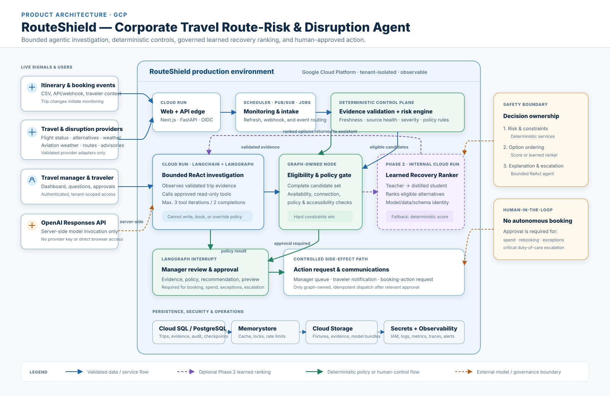

# RouteShield

> Project author: Sarala Biswal

RouteShield is a reference implementation of **human-controlled operational decisioning**,
applied to corporate flight disruption. It gives travel operations teams an early,
evidence-backed view of trips likely to be disrupted, so a manager can intervene safely and
in time — before a traveler misses a connection, meeting, or other critical obligation.
RouteShield deliberately contains no booking, payment, cancellation, or policy-override side
effects.

## The generalized business problem

Across operations domains, teams must make time-sensitive, high-consequence decisions from
fragmented, fast-changing, and sometimes unreliable signals. Existing systems may surface
alerts, but they rarely combine evidence, apply policy consistently, preserve an audit trail,
and maintain a clear boundary between a *recommendation* and the *authority to act*.

RouteShield uses corporate flight disruption as a concrete example of that broader problem.
Flight status, connection time, airport weather, ground traffic, and destination conditions
each arrive from different sources, with different freshness and reliability. A travel
manager must reconcile all of this while respecting tenant policy, traveler constraints,
privacy requirements, and the rule that a recommendation is not authorization to act.

The reusable solution pattern addresses three operational gaps:

- **Earlier detection** — identify material risk as soon as an operational event arrives, on
  scheduled monitoring windows, or when source evidence changes.
- **Defensible decisions** — turn source-linked evidence into a reproducible assessment and a
  concise recommendation, rather than an untraceable alert.
- **Human-controlled recovery** — present policy-eligible options for review, record the
  authorized decision, and keep consequential external actions under separate control.

### Flight-disruption example

A traveler is booked from San Francisco to Chicago via Denver. The first flight is delayed,
weather in Denver is deteriorating, and the connection buffer is now too short. RouteShield
validates and time-stamps these signals, calculates a reproducible risk score, and marks the
trip High or Critical rather than treating missing or stale data as low risk. Its bounded
investigation workflow can retrieve approved, read-only alternatives and check corporate
policy. A manager then reviews the evidence and recommendation, records an approval or
rejection, and may queue an approved traveler notification. RouteShield does not
autonomously rebook or spend money.

## How the architecture solves it


Read the diagram as a general operating pattern: in a different domain, the input signals,
deterministic assessment rules, policy constraints, and authorized action would change, while
the evidence, human-approval, and audit controls remain the same.

Each layer has a distinct responsibility:

- **Ingestion and tenant isolation** validate itinerary data, scope every record to a tenant,
  and reject malformed or replayed webhooks before they reach the decision workflow.
- **Provider adapters** normalize live or fixture evidence into a common envelope with
  source, retrieval time, expiry, and reliability state. Missing evidence is explicit — it
  never becomes a false low-risk result.
- **The deterministic risk engine** owns the weighted score, severity, and policy version,
  keeping the material risk decision explainable and reproducible rather than delegated to
  an LLM.
- **The bounded investigation graph** engages only when elevated risk needs interpretation.
  Its tools are read-only, tenant-scoped, iteration-limited, and evidence-citation
  validated. It can recommend an option but cannot execute a booking or payment action.
- **Recovery, approval, and notification controls** filter alternatives through corporate
  policy, persist the recommendation and approval state, and use idempotent outbox records
  to prevent duplicate delivery or action attempts.
- **Operational safeguards** provide OIDC-based access control in deployed environments,
  audit-log redaction, retention/DSAR/legal-hold workflows, runtime kill switches,
  monitoring, and recovery runbooks.



The result is an operations-assistance system: it reduces the time to understand and
prioritize a disruption, while keeping policy decisions, sensitive data, and external side
effects under human and platform control.

## Quick start

```bash
uv sync --all-groups
uv run uvicorn apps.api.main:app --reload
```

Then open `http://127.0.0.1:8000/docs`. Run checks with:

```bash
uv run ruff check .
uv run pytest
```

The local operations console is available at `http://127.0.0.1:8000/console/`. It accepts
development headers when `REQUIRE_OIDC=false`; deployed environments set
`REQUIRE_OIDC=true` and derive tenant, actor, and role solely from a validated bearer token.

### Local full-stack demonstration

Run the API, web console, PostgreSQL, Redis, and a credential-free mock evidence provider:

```bash
docker compose up --build
```

The API is available at `http://127.0.0.1:8000`, and the separate web console at
`http://127.0.0.1:8080`. Compose uses the standard HTTP provider-adapter path against the
local mock provider; it does not call real travel, weather, routing, or advisory services.

To exercise the server-side OpenAI model boundary locally, supply a development-only API key
from your shell and opt in explicitly. The model may select one validated read-only lookup;
the server retains ownership of tool validation, evidence access, scoring, ranking,
approval, and side effects.

```bash
OPENAI_API_KEY='...' LLM_ENABLED=true REACT_TOOL_CALLS_ENABLED=true docker compose up --build
```

Never add that key to Compose files, source code, or a committed environment file.

## Current scope

- Validated U.S.-origin, one-to-three-segment itinerary requests.
- Tenant-scoped in-memory repository for local runs, and a PostgreSQL repository selected
  via `DATABASE_URL` for deployed runs.
- Evidence envelopes with explicit freshness states and provider-neutral collection
  contracts.
- Explainable, deterministic weighted risk score and severity bands.
- Fixture-backed baseline collection for normal, disruption, and source-outage
  demonstrations.
- A Compose full stack that uses the same bounded HTTP provider adapters against a local
  mock provider, with no GCP or third-party provider configuration required.
- Source-health routing that requests human review when flight status is unavailable for a
  High/Critical trip, or when multiple core signals are unavailable.
- Safe assessment API routes, seedable evidence, and model/external-provider calls disabled
  by default.
- High/Critical incident creation with a bounded, read-only investigation audit and a
  source-linked, approval-required recommendation.
- Manager queue, incident detail, evidence timeline, approve/reject, refresh, traveler
  preference, and notification-preview UI. Approval is recorded only — it never dispatches
  a booking action.
- Traveler-memory proposal and explicit confirmation workflow, with versioned, tenant-scoped
  preference profiles, a minimal memory-audit trail, preference-memory erasure, and a
  retention job.
- Durable notification queue with attempt/retry/failure/delivery/acknowledgement records,
  and a safe in-app sender. External channels remain disabled until provider onboarding is
  approved.
- Recursive audit-log redaction and per-tenant/actor/route API rate-limit responses.
- Parameterized GCP Terraform for private Cloud SQL/Redis/VPC, Pub/Sub, Scheduler, Storage,
  IAM, Secret Manager bindings, Cloud Run, monitoring, a migration job, and deployment
  workflows.
- Golden provider/policy/model-grounding checks, plus security, tenant-isolation, retention,
  and notification control tests.
- V2 typed LangGraph workflow contract: tenant-scoped thread IDs, severity routing, a
  read-only tool allow-list, one model-directed tool-selection call plus a final
  recommendation call when enabled, a three-tool limit, evidence-citation validation, model
  audit metadata, and a human-approval interrupt.

See [ProductPRD.md](ProductPRD.md) for the complete product contract and the
[code-flow learning path](docs/learning-path.md) for a guided tour of the implementation.

## Production inputs and operating boundary

The API defaults to fixture evidence and an auditable deterministic fallback, so it is safe
to run without credentials. Docker Compose can instead use its local mock provider without
any GCP configuration. Deployment still requires the GCP project/network choice, an OIDC
issuer and claims mapping, approved retention/notification privacy policies, provider
contracts/quotas, and Secret Manager values. See [production tasks](docs/production-tasks.md),
[evaluation gates](docs/evaluations.md), and [runbooks](docs/runbooks.md).

## Remaining work before production activation

The core application code, local mock-provider workflow, evaluation suite, and delivery
configuration are in place. The remaining MVP work either depends on external decisions or
cannot be safely enabled without tenant approval:

- Provide the GCP project, region, billing account, domain, IAM owners, and the approved
  VPC/Cloud SQL connectivity design.
- Configure Secret Manager with the OpenAI service key, database/Redis connection details,
  and approved provider credentials; then enable and validate the live flight, weather,
  routing, and advisory adapters in staging.
- Supply the OIDC issuer, audience, JWKS URL, and claims mapping before setting
  `REQUIRE_OIDC=true` in deployed environments.
- Complete provider onboarding: executed contracts, quota ownership, data classifications,
  and approved retention and privacy policies.
- Select and approve an external notification provider, then implement and validate its
  adapter. In-app notifications are available today; external delivery is deliberately
  disabled until this is approved.
- Map provider-native itinerary change and cancellation payloads to the canonical webhook
  contracts once each provider's schema is approved.
- Apply the Terraform stack, run migrations, complete staging smoke tests, and obtain
  production deployment approval.

The Learned Recovery Ranker is intentionally deferred to Phase 2. It requires governed
outcome data, a documented label policy, offline evaluation and promotion gates, and then an
internal-only shadow/canary deployment with deterministic fallback. It is not an MVP
production blocker.

The latest local verification passed `uv run ruff check .` and all 76 automated tests.
Terraform formatting and validation run in CI; install Terraform locally to run those checks
outside CI.

## V2 local architecture

- `agent/` — bounded LangGraph workflow, ready for a production PostgreSQL checkpointer.
- `domain/recovery.py` — hard eligibility filter and deterministic recovery ordering.
- `tools/providers.py` — provider-neutral fixture adapter seam.
- `infra/sql/schema.sql` — tenant-scoped PostgreSQL schema baseline.
- `tools/migrate.py` — additive schema migration entry point.
- `infra/terraform/` — parameterized Cloud Run/GCP delivery stack.
- `.github/workflows/` — CI, staging deployment/migration/smoke test, and approval-gated
  production deployment workflow.
