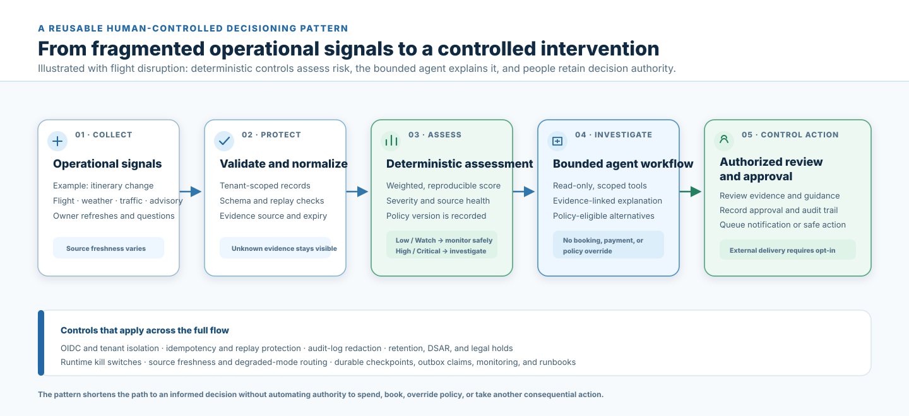

# RouteShield Code-Flow Learning Path

Project author: Sarala Biswal

This path is for developers who want to understand how RouteShield turns a travel signal into a
human-controlled recommendation. Follow the modules in order; each step points to the code that
implements the preceding step.

## Before you start

1. Read the [README](../README.md) for the business problem, safety boundary, and local setup.
2. Start the local stack with `docker compose up --build` when you want to observe the console.
3. Run `uv run pytest` before changing behavior. The tests are concise executable examples of the
   contracts described below.

The most important rule to keep in mind is that RouteShield can assess and recommend, but cannot
book, pay, cancel, or override policy on its own.

## The code flow at a glance



Use the diagram as the visual map for the reading path below: each stage maps to a concrete
module, while the final human-approval boundary remains outside automated decisioning.

```text
browser / webhook / scheduled job
        |
        v
FastAPI route and authorization              apps/api/main.py
        |
        v
normalized evidence snapshot                 tools/live_providers.py
        |
        v
deterministic score and source health        domain/risk_engine.py + apps/api/main.py
        |
        +-- low/watch --> monitor or manager queue
        |
        +-- high/critical --> bounded LangGraph investigation
                                  |
                                  v
                         policy eligibility and deterministic ranking
                                  |
                                  v
                         approval interrupt and audit record
                                  |
                                  v
                         manager decision / optional notification
```

## 1. Learn the vocabulary and safety boundaries

Read [`domain/models.py`](../domain/models.py) first. It defines the contracts shared by every
layer: `Trip`, `EvidenceEnvelope`, `RiskAssessment`, `Incident`, `Recommendation`, and approval
records. These Pydantic models are the fastest way to learn which fields are allowed to cross a
boundary.

Then read [`domain/policies.py`](../domain/policies.py) and
[`domain/recovery.py`](../domain/recovery.py). Notice the order of operations:

1. Corporate policy rejects ineligible recovery options.
2. Confirmed traveler constraints may make an option more restrictive.
3. Only remaining eligible options receive a deterministic ranking.
4. An approval record, not the ranking, authorizes the next human-controlled step.

Try: run `uv run pytest tests/test_recovery.py tests/test_policies.py` and use the assertions as
examples of the rule boundaries.

## 2. Follow a request into the API

Read `create_trip` and `assess_trip` in [`apps/api/main.py`](../apps/api/main.py). These are the
primary entry points for the demonstration flow.

`assess_trip` has five phases:

1. Validate tenant, actor role, and trip assignment.
2. Claim the idempotency key so a retry does not create a second assessment.
3. Reuse or collect a normalized evidence snapshot and emit source-observation events.
4. Calculate the deterministic risk score and determine the safe disposition.
5. Persist a manager-review incident only when review is required.

Read [`apps/api/idempotency.py`](../apps/api/idempotency.py) alongside this function. Request
fingerprints bind an idempotency key to one route and payload, so the same key cannot be reused
for a different action.

Try: read `test_disruption_fixture_routes_to_bounded_investigation` and
`test_high_risk_incident_has_bounded_read_only_audit_and_requires_approval` in
[`tests/test_api.py`](../tests/test_api.py).

## 3. Understand evidence collection and freshness

Read [`tools/providers.py`](../tools/providers.py), then
[`tools/live_providers.py`](../tools/live_providers.py). A provider adapter returns an
`EvidenceEnvelope` even when the provider is disabled, unavailable, or its circuit is open. That
explicit result is important: missing information must not look like a low-risk signal.

For local Compose, [`apps/mock_provider/main.py`](../apps/mock_provider/main.py) is a
credential-free HTTP stand-in. For deterministic tests and the explicit demo scenarios, read
[`tools/evidence.py`](../tools/evidence.py). Its three profiles are `normal`, `disruption`, and
`source_outage`.

Try: compare the expected evidence in `tests/test_providers.py` with the provider envelopes shown
in a selected console incident.

## 4. Verify the deterministic risk decision

Read [`domain/risk_engine.py`](../domain/risk_engine.py). It applies a versioned set of weights to
the normalized factors and records every weighted contribution. `severity_for_score` maps the
score to Low, Watch, High, or Critical.

Back in `apps/api/main.py`, read `source_health_for` and `disposition_for`. The score and source
health are separate decisions. For example, High/Critical risk with unavailable flight status is
sent to human review even if other sources are healthy.

Try: run `uv run pytest tests/test_risk_engine.py tests/test_api.py -k 'source or risk'`.

## 5. Trace the bounded investigation graph

Read [`agent/state.py`](../agent/state.py) before
[`agent/graph.py`](../agent/graph.py). The typed state shows every value that may enter the graph.
The graph never receives provider credentials, raw provider payloads, or arbitrary user tools.

Follow these nodes in `build_graph`:

1. `route_by_severity` bypasses the model when core evidence is unavailable.
2. `load_memory_context` allow-lists confirmed traveler preferences and approved playbooks.
3. `react_assistant` optionally requests one validated, read-only lookup from the model.
4. `run_read_only_tool` validates that lookup against the existing evidence snapshot; it does not
   make a new provider call.
5. `validate_recommendation` accepts only citations from that snapshot and falls back safely on
   invalid output.
6. `verify_alternative_eligibility` and `rank_eligible_recovery_options` remain server-owned.
7. `approval_gate` interrupts the graph with an approval payload; it never dispatches an action.

Read [`tools/openai_provider.py`](../tools/openai_provider.py) after the graph. It defines the
restricted tool schema and model-output validation. The graph works deterministically when model
access is disabled or fails.

Try: run `uv run pytest tests/test_graph_contract.py tests/test_openai_provider.py`.

## 6. Learn persistence, audit, and asynchronous boundaries

Read [`apps/api/repository.py`](../apps/api/repository.py) for the in-memory development seam,
then [`apps/api/postgres_repository.py`](../apps/api/postgres_repository.py) for durable storage.
Every read and write is tenant-scoped. Event details are redacted before persistence.

Next, read [`apps/api/notifications.py`](../apps/api/notifications.py) and
[`apps/api/actions.py`](../apps/api/actions.py). These use durable records and idempotency keys.
They are separate from graph reasoning so a recommendation never becomes an external side effect
by accident.

Try: inspect `tests/test_idempotency.py`, `tests/test_operational_resilience.py`, and
`tests/test_webhook_security.py`.

## 7. Connect the backend to the console

Read [`apps/web/index.html`](../apps/web/index.html), then
[`apps/web/app.js`](../apps/web/app.js). The user flow is deliberately visible in the UI:

1. Review a priority queue.
2. Inspect the itinerary, evidence, and policy-eligible options.
3. Approve or reject with a reason.
4. Preview and queue an in-app traveler notification.

The UI creates DOM nodes with `textContent`, not injected HTML. It reads only browser-safe runtime
configuration from [`apps/web/server.py`](../apps/web/server.py); service credentials remain in the
API environment.

## 8. Learn the deployment boundary last

Read [`docker-compose.yml`](../docker-compose.yml) to understand the local services: web, API,
mock provider, PostgreSQL, and Redis. Then read [`infra/terraform/main.tf`](../infra/terraform/main.tf)
and the staged instructions in [`runbooks.md`](runbooks.md). Terraform defines cloud resources;
it does not supply the external approvals, credentials, or GCP project decisions listed in
[`production-tasks.md`](production-tasks.md).

## Suggested learning sequence

| Session | Focus | Main files | Outcome |
|---|---|---|---|
| 1 | Domain and score | `domain/models.py`, `risk_engine.py` | Explain a risk score and severity. |
| 2 | API and evidence | `apps/api/main.py`, `tools/providers.py` | Trace one assessment request. |
| 3 | Graph and policy | `agent/graph.py`, `domain/policies.py` | Explain why the model cannot bypass policy. |
| 4 | Storage and recovery | repository, notifications, actions | Explain replay and side-effect safeguards. |
| 5 | UI and deployment | `apps/web/`, Compose, runbooks | Run the local console and identify production prerequisites. |

## Guardrails to preserve when changing code

- Keep tenant, trip, and actor authorization checks at API boundaries.
- Treat unavailable or stale core evidence as uncertainty, never as an all-clear.
- Keep scoring, policy eligibility, and ranking deterministic and versioned.
- Keep model tools read-only, allow-listed, bounded, and tied to the current evidence snapshot.
- Require a recorded human decision before external actions; make every side effect idempotent.
- Extend tests and the [evaluation gates](evaluations.md) whenever behavior changes.
